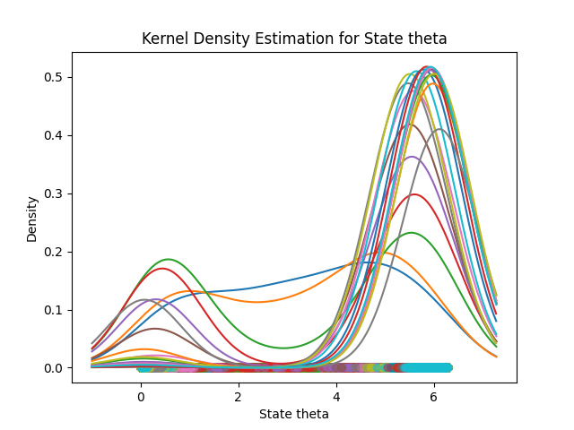

# Helicopter landing simulation with the particle filter algorithm

## Project Overview

This project aims to develop a simulation program for tracking the position and orientation of an autonomous helicopter during its landing on a platform. The core objective is to implement a particle filter algorithm for this purpose to counter the noise in both tracking and movement, allowing users to input filtration parameters and visualize the helicopter's state estimation over time.

## Installation

1. **Clone the repository:**
   ```bash
   git clone https://github.com/pienski/helicopter-landing.git
   cd helicopter-landing-simulation
   ```

2. **Install dependencies:**
   Ensure you have Python and the necessary libraries installed. You can use `pip` to install required packages:
   ```bash
   pip install -r requirements.txt
   ```

## Usage

1. **Run the simulation:**
   ```bash
   python main.py
   ```

2. **Input Parameters:**
   You can either use default parameters, or set parameters such as the number of particles, standard deviation, number of markers, plot type (observations or ) and resampling algorithm (systematic or multinomial) through the user interface.

3. **View Results:**
   The simulation results will be displayed as graphs.

   ### Observations
   Sequential graph of the helicopter's position and orientation over time (red dot and arrow), position of particles (blue dots) and position of markers (green dots). Demonstrated as a 2D plane from the top view.
   

   ### Probability density function
   Sequential graph of the probability density function of the helicopter's position or orientation over time, estimated with kernel density estimation.
   

## Project Structure

- `main.py`: Entry point of the program.
- `run_simulation.py`: Contains the main simulation loop. Responsible for communication with other modules and for the process.
- `particle_filter.py`: Contains the implementation of the particle filter algorithm.
- `environment.py`: Creates a heliport.
- `landing_simulator.py`: Creates a helicopter and moves it across the heliport.
- `presentation.py`: Manages the visualization of results.
- `testing.py`: Simulations for algorithm testing.